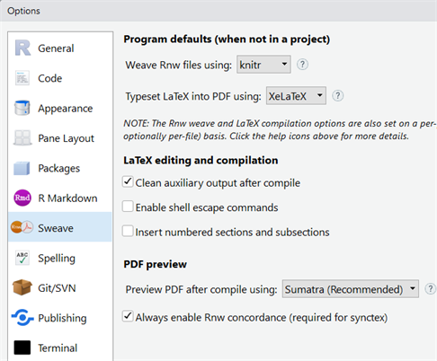
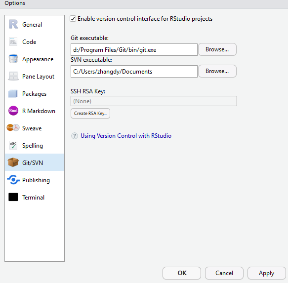
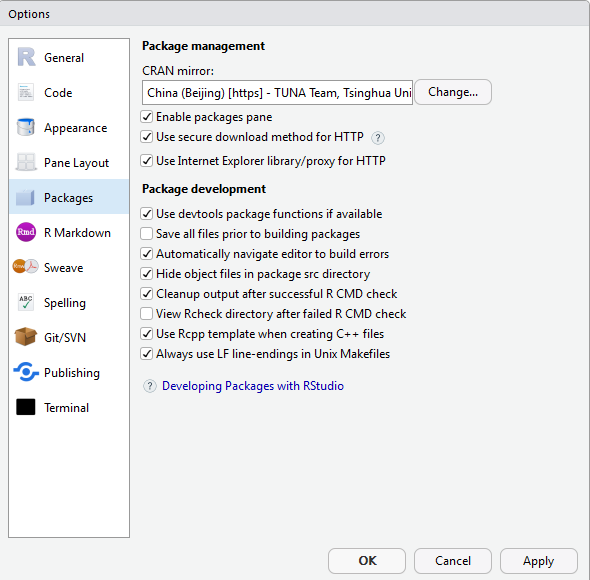
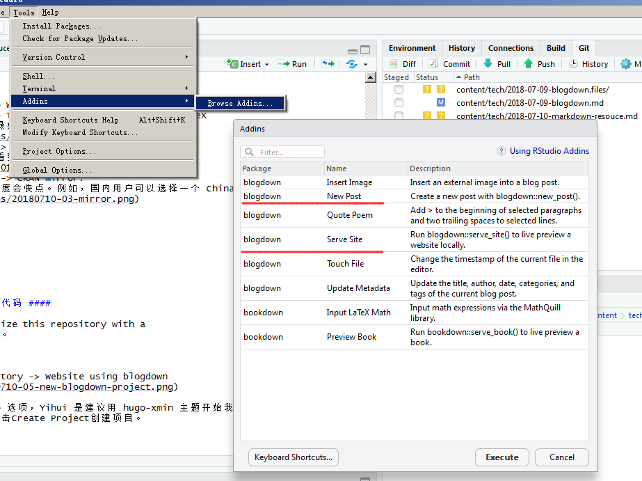
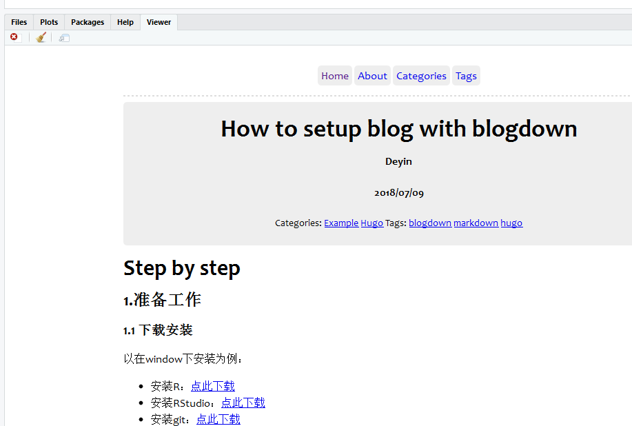
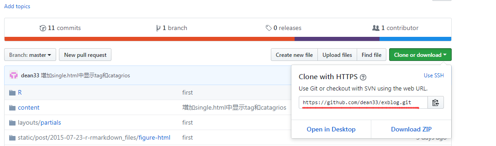

# Step by step  #

## 1.准备工作 ##
### 1.1 下载安装 ###
以在window下安装为例：

- 安装R：[点此下载](https://www.r-project.org/)
- 安装RStudio：[点此下载](https://www.rstudio.com/products/rstudio/download/#download)
- 安装git：[点此下载](https://git-scm.com/download/win)

### 1.2 RStudio设置 ###

- Tools -> Global Options -> Sweave -> Weave Rnw files using:knitr
- Tools -> Global Options -> Sweave -> Typeset LaTex into PDF using:XeLaTeX
	- 这个是生成 PDF 文件用的，中文用户最好选择 XeLaTeX 
		
- Tools -> Global Options -> Git/SVN -> Git executable:
	- 安装好 git 后，打开这里应该就可以看到 git 的路径了
		
- Tools -> Global Options -> Packages -> CRAN mirror:
	- 建议选择一个距离你比较近的镜像，速度会快点。例如，国内用户可以选择一个 China 的镜像。
		

### 1.3 安装blogdown 和 hugo ###

在RStudio的Console中执行：
> install.packages('blogdown')

安装Hugo：
> blogdown::install_hugo()

### 1.4 创建github仓库用于存放blog项目代码 ####

创建一个空白仓库即可，不必勾选“Initialize this repository with a README”。稍后从本地git仓库push到remote。

## 2 构建本地blogdown项目 ###
### 2.1 RStudio中blogdown建站 ####
打开：File -> New Project -> New Directory -> Website using blogdown

因为我们已经安装了 hugo，所以去掉 hugo 选项，Yihui 是建议用 hugo-xmin 主题开始我们的 blogdown 之旅的，所以这里就选择了 hugo-xmin。点击Create Project创建项目。

### 2.2 新建一篇blog并运行本地webserver ####

在RStudio本地可查看到刚添加的blog文章：

### 2.3 项目文件commit到本地git仓库 ####

### 2.4 本地git仓库push到remote的git仓库 ####

Repository URL（注意URL是以.git结尾的）

###  ###

## 3  ###

## 4  ###

## A.更多参考 ##

1. Yihui写的一本blogdown的电子书:[blogdown: Creating Websites with R Markdown](https://bookdown.org/yihui/blogdown/)
2. Yihui认为写的最好的一篇blogdown教程:[Up and running with blogdown](https://alison.rbind.io/post/up-and-running-with-blogdown/)